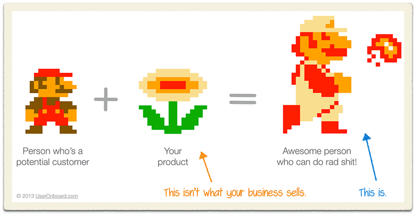
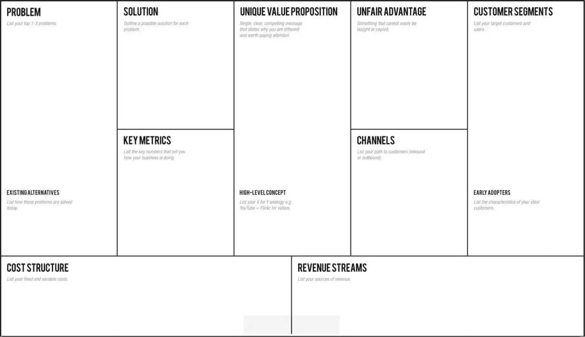

# Lean startup

## Introduction 

La méthodologie "Lean Startup" est une façon de s'organiser et de prioriser le travail quand on est en contexte d'innovation (problème et solution mal connus) avec des ressources très contraintes

Un des outils clefs, c'est la boucle "Build Measure Learn"

Concrètement, dans l'ordre ça se passe comme ça :
- Lister les **problèmes** que l'on imagine
- **confirmer** que des personnes sont concernées par ce problème
- Construire une **solution minimale** (MVP) qui permet de résoudre un problème
- Mettre en place ce qu'il faut pour **confirmer** que la solution résoud le problème
- Recommencer

Lean startup invite à faire différentes séparations : 
- ce que l'on sait / ce que l'on ne sait pas
- ce qui est un problème / ce qui est une solution

<!-- "Réussite par le non-échec" -->

### Exemple

**Problème** : Mes jeans se déchirent à l'entre-jambe

**Solutions possibles** : 
- Racheter un autre jean
- Payer un atelier de retouche pour le faire réparer
- Apprendre à coudre et réparer moi-même

... mais **ptèt que ce n'est pas un problème** et que je trouve ça stylé !

Pour la différence entre un problème et une solution, voir aussi avec Mario:

## Running Lean

Running Lean est une méthodologie concrète inspire de (Lean Startup) décrite dans un livre du même nom

### Lean Canvas

Running Lean, ça commence par exemple par remplir le Lean Canvas rapidement (genre 20 minutes)

Le contenu de chaque case est une **hypothèse** pour laquelle on va mettre en place une expérience pour la valider ou l'invalider

Si on galère à remplir une case, c'est cool, c'est qu'on n'a pas de bonne hypothèse, donc il peut être pertinent de très vite aller voir le monde réel pour formuler une première hypothèse

Aussi, vu que tout est une hypothèse, c'est ok de se tromper. On le découvrira rapidement.

Contrairement à d'autres méthodologies (genre *business plan*), dans Running Lean, on passe moins de temps à se produire un document et plus de temps à aller sur le terrain rencontrer des vraies personnes